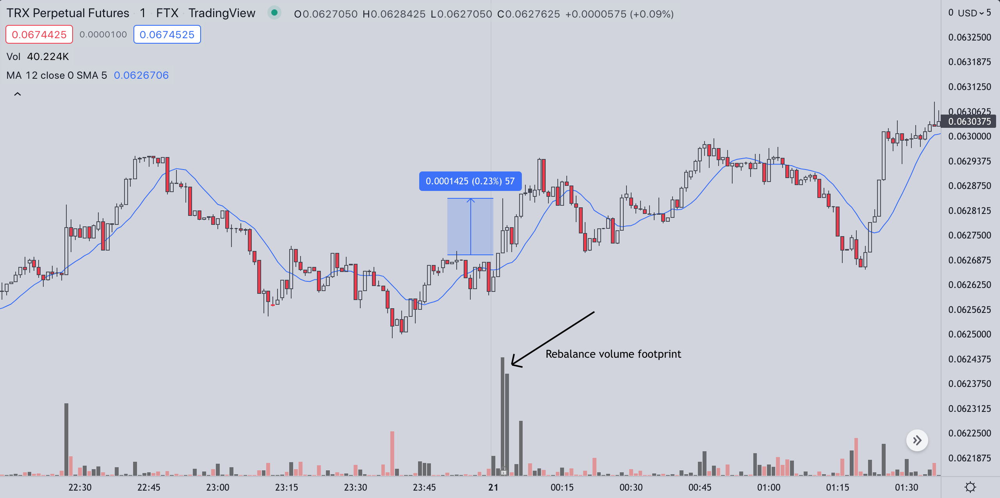

# Front-running FTX Leveraged Token Rebalancing

## What are Leveraged Tokens?
FTX offer a range of ETFs which they call [Leveraged Tokens](https://help.ftx.com/hc/en-us/articles/360032509552-Leveraged-Token-Walkthrough-READ-THIS-).  
These include BULL(3x), BEAR(-3x), HEDGE(-1x), HALF(0.5x) and the retired MOON(10x) tokens.

These instruments aim to give retail participants leveraged exposure to underlying assets without risk of account liquidation.

There are many details to the ETFs (explained [here](https://help.ftx.com/hc/en-us/articles/360032509552-Leveraged-Token-Walkthrough-READ-THIS-)) but essentially, they are physical (erc20/bep20) assets that manage their own collateral by aiming to hold a certain amount of the underlying FTX PERP(etual) instrument, in an attempt to multiply returns. 

For example, if a user purchases DOGE-BULL(3x) and the price of DOGE-PERP moves up 10%, that user can expect their DOGE-BULL tokens to be worth approximately 30% more than when they bought. 

If DOGE-PERP drops in value, their losses are also multiplied and the tokens should be worth 30% less in USD value.

## So?
Each token can be thought of as an *account* and to maintain the desired leveraged, each account is requried to "rebalance" itself daily by buying or selling the underlying perpetutal instrument.

**They do this every day at roughly the same time. 00:02 UTC.**

Every day between 00:02 and 00:03, over 150 FTX leveraged tokens will slam their respective books with IOC orders, creating dramatic volatility and abnormally large candles.

It is also possible to exactly calculate the dollar amount of each trade before it happens by looking at a tokens current holdings, leverage ratio, collateral, etc.

The footprint is obvious, especially when lower 'cap tokens make large percentage moves, resulting in larger rebalances.

## What's the catch?
The counterparty is probably Alameda.